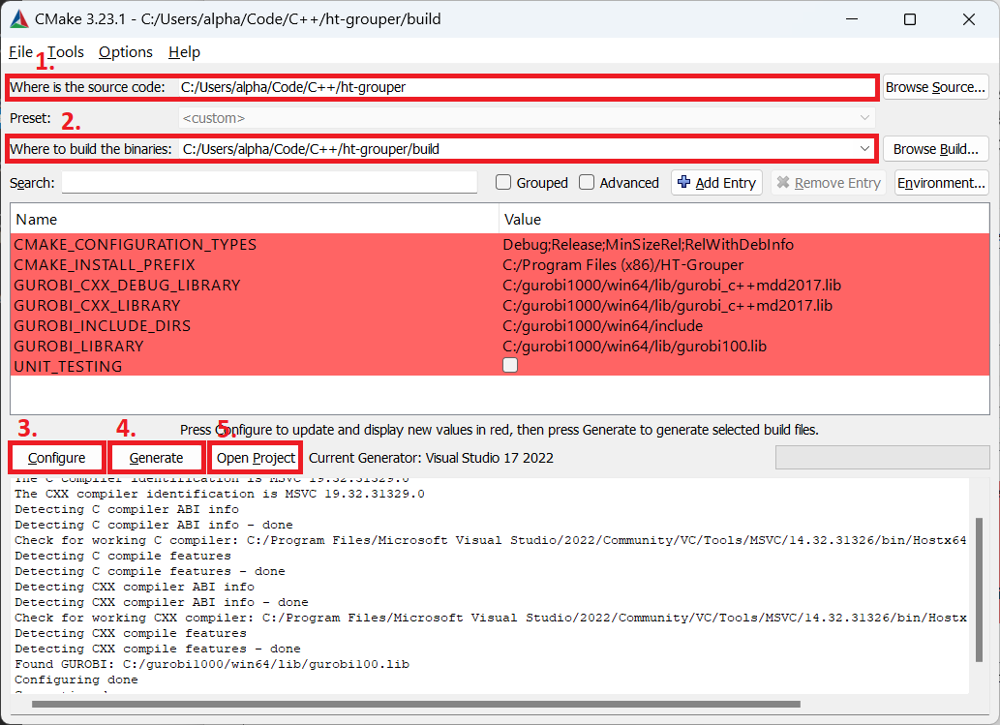
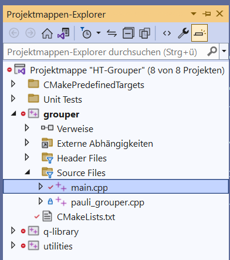

# Installation Guide

We highly recommend using Visual Studio 2019 or 2022 (note: not Visual Studio Code). Gurobi does not support Visual Studio Code. If you have an older version of Visual Studio 2019 you may need to update in order to get a recent C++ compiler. 

## Installing Visual Studio

In order to build and run the C++ code, you will need Visual Studio (a more thorough setup guide can be found [here](https://learn.microsoft.com/en-us/cpp/build/vscpp-step-0-installation?view=msvc-170)). 

- Get the Visual Studio Installer https://visualstudio.microsoft.com/de/downloads/. The Community Edition is for free and fully functional.
- Start the installer and when prompted which packages to install check the __Desktop Development with C++__ and start the installation. 

## CMake

The project uses [CMake](https://cmake.org/), a build tool for C++. 

- If you don't already have CMake, install it from https://cmake.org/download/

## Gurobi

This project depends on [Gurobi](https://www.gurobi.com/), a commercial mathematical optimization software. There are [special offers for academics](https://www.gurobi.com/academia/academic-program-and-licenses/).

## Build project files with CMake

- Download or clone this repository. 
- Open the Program ``CMake GUI`` which should be available after installing CMake. 
- In the field `Where is the source code`, specify the **path of the repository** (e.g., `C:/[path-to]/ht-grouper`). 
- In the field `Where to build the binaries`, type the same path and **append `/build`** (e.g., `C:/[path-to]/ht-grouper/build`). 
- At the bottom left, **press `Configure`**. Accept the creation of the build directory. In the next dialog, select your version of Visual Studio. If you don't have other CMake generators installed, this will already be selected. Press `Finish`. 
- Next to `Configure`, **press `Generate`**. If no red error messages show up in the **bottom** output field, everything is ready now. 
- **Hit `Open Project`**. 

## If you have never used Visual Studio before

Now, the project opens up in Visual Studio. In the sidebar, the `Solution explorer` shows the current projects. You should see the `grouper` project shown in bold letters. If not, right-click on `grouper` and select `Set as startup` project. Pressing the F5 key, will now build the `grouper` project. The other projects are libraries and don't need to be run. 

Locate the `main.cpp` file in the solution explorer by expanding the `grouper` project and then expanding `Source Files`. In this file, you can tune parameters and set the input/output files. 

If you have never really used C++ or similar languages before, you might not be familiar with "Debug" vs. "Release" compilation. In Debug mode, the compiler generates a variety of checks and instrumentation to allow inspecting the code during runtime. In Release mode, this information is omitted and furthermore, the program code is passed through the optimizer. The resulting code can be orders of magnitude faster than the code built in Debug mode. 

For running the grouper with many Paulis, it is worth changing the configuration to Release. This can be done from the top option bar. 
